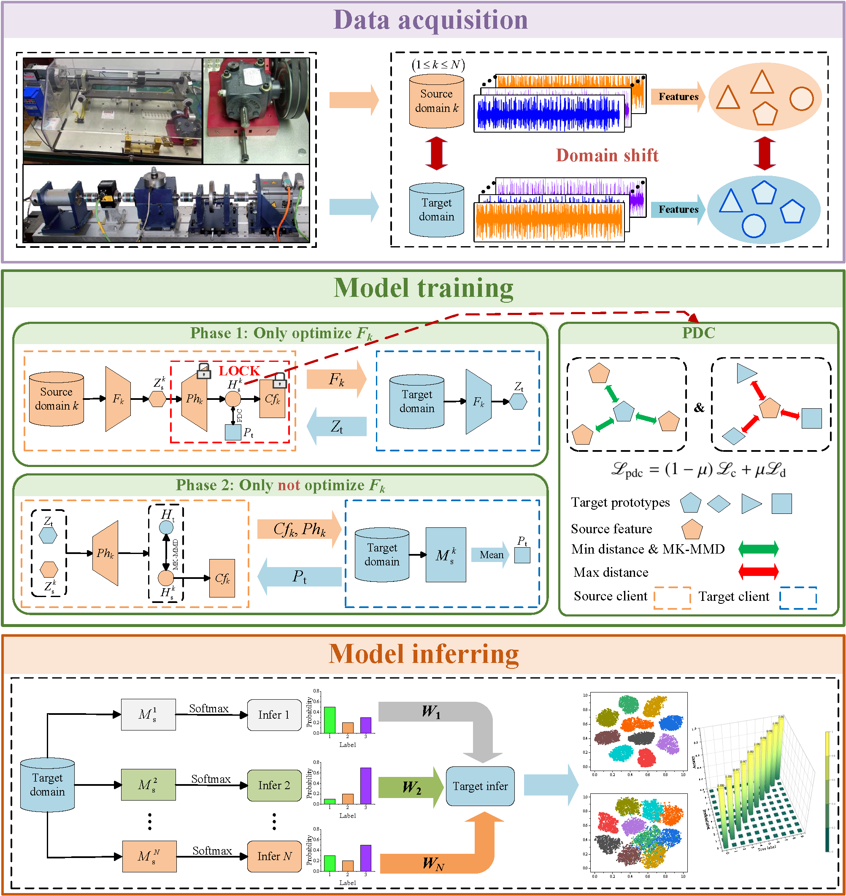

# **Prototype contrastive-based decentralized federated transfer learning for intelligent fault diagnosis**

------



**📂 Code Structure**

```
PCDFTL/
├── entity/            # 客户端实体目录
│   ├── client.py      
│   ├── clientBase.py  
│   ├── serve.py       
│   ├── serveBase.py   
├── loss/              # 损失函数目录
│   ├── contrast.py    
│   ├── mkmmd.py       
├── utils/             # 工具类目录
│   ├── analyzer.py    
│   ├── args.py        
│   ├── …………		  // 其余文件不做解释
├── PCDFTL.py          # 训练脚本
└── requirements.txt   # 依赖列表
```

**📄Citation**

If you find this code useful in your research, please cite our paper:

```
@article{li2026prototype,
  title={Prototype contrastive-based decentralized federated transfer learning for intelligent fault diagnosis},
  author={Li, Zhaokang and Wan, Lanjun and Ning, Jiaen and Ni, Wei and Li, Keqin},
  journal={Engineering Applications of Artificial Intelligence},
  volume={164},
  pages={113322},
  year={2026},
  publisher={Elsevier}
}
```

